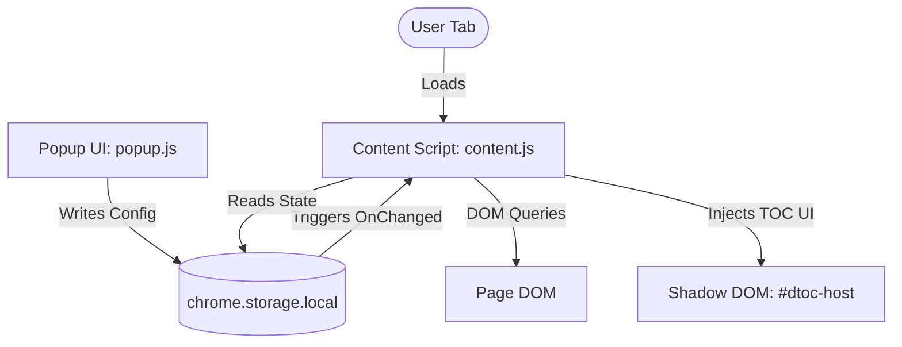

# DTOC System Architecture

## System Overview

DTOC (Dynamic Table of Contents) is a browser extension for Google Chrome (MV3) and Mozilla Firefox that generates a persistent, dynamic Table of Contents (TOC) overlay on supported websites (see [SUPPORTED_SITES.md](../SUPPORTED_SITES.md)) and unsupported websites via manual opt-in (Beta mode).

Rather than using complex background script message passing, DTOC operates on a **storage-driven state synchronization architecture**. The content script and popup coordinate states entirely via `chrome.storage.local`.



---

## Core Components

1. **Content Script** (`content.js`):
   - Injected into all matching web pages.
   - Determines if the current URL is in view mode or edit mode.
   - Injects a Shadow DOM element (`#dtoc-host`) containing the TOC overlay container, styles, and control buttons (minimize, close, maximize).
   - Monitors DOM changes via a debounced `MutationObserver` and periodic checks to rebuild the heading list reactively.
   - Synchronizes UI state dynamically when storage settings change.

2. **Popup UI** (`popup.html` / `popup.js` / `popup.css`):
   - Loaded when the user clicks the extension icon.
   - Manages global settings (ON/OFF, position) and site-specific overrides.
   - Displays a "Beta" badge and experimental support messages on unsupported domains.
   - Persists all settings changes directly to `chrome.storage.local`.

3. **Storage Layer** (`chrome.storage.local`):
   - Single source of truth for synchronization.
   - Shared between the popup and content scripts.

---

## Data Structures & Storage Schema

DTOC stores its settings in the root of `chrome.storage.local` using the following keys:

```javascript
{
  // Global active state of the extension
  "enabled": true, // boolean

  // Global position of the TOC overlay
  "position": "left", // "left" | "right"

  // User-controlled states of the TOC overlay on the current page
  "closed": false, // boolean
  "minimized": false, // boolean

  // Map of site-specific overrides (keys are domain names with 'www.' stripped)
  "siteSettings": {
    "medium.com": {
      "enabled": true, // Override to enable/disable on this domain
      "position": "right" // Override position for this domain (optional)
    },
    "levelup.gitconnected.com": {
      "enabled": true
    }
  }
}
```

### Inheritance Resolution
When a content script initializes or storage changes, the script resolves settings using the following precedence:
1. **Global Toggle Check**: If global `enabled` is `false`, the TOC is hidden regardless of site-specific configurations.
2. **Site Enablement**:
   - If domain exists in `siteSettings`: uses `siteSettings[domain].enabled`.
   - If domain does not exist in `siteSettings`: defaults to `true` for natively supported sites (see [SUPPORTED_SITES.md](../SUPPORTED_SITES.md)), and `false` for unsupported sites.
3. **Position**:
   - If domain has a site override `siteSettings[domain].position`: uses overridden position.
   - Otherwise: uses global `position`.

---

## Content Parsing and Normalization

The extraction flow performs the following actions:

### 1. View Mode Detection
To avoid cluttering text fields and editors, DTOC automatically disables itself on editing routes or homepages.
- **Confluence**: Excludes paths containing `/edit` or `/edit-v2`, and query parameters `mode=edit`.
- **Dev.to**: Excludes `/new`, paths ending in `/edit`, or path containing `/edit/`, and the homepage `/`.
- **Medium**: Excludes `/new-story`, paths ending in `/edit`, or path containing `/edit/`, and the homepage `/`.
- **Generic Sites**: Excludes editing keywords (`/edit`, `/editor`, `/write`, `/new`, `/compose`, `/draft`) and root paths.

### 2. Main Content Container Target
TOC headings are parsed ONLY from within the main content container to prevent indexing sidebars, site navigation, and footers. The container is resolved via prioritized selectors:
- **Confluence**: `#main-content`, `#content`, `.ak-renderer-document`, `.wiki-content`
- **Dev.to**: `#article-body`, `.crayons-article__body`, `.crayons-article__main`
- **Medium**: `article`
- **Generic Sites**: `article`, `main`, `[role="main"]`, `#main`, `#content`, `.post-content`, `.article-content`, `.entry-content`, `body`

### 3. Heading Normalization & Navigation
- The content script queries `h1, h2, h3, h4, h5, h6` elements inside the resolved container.
- **Slugification**: If a heading lacks an `id` attribute, it generates one based on its text content (e.g. `<h2>Architecture Overview</h2>` gets `id="dtoc-architecture-overview"`). Duplicate IDs are suffixed numerically.
- **Page Title Prepend**: The page title (e.g., extracted from Confluence `h1#title-text`, Dev.to `h1.crayons-title`, or document title) is prepended to the TOC as the top item. Clicking it scrolls to the top of the page.
- **Offsets**: A smooth-scroll action triggers `scrollIntoView()`. To account for sticky site headers, a temporary `scrollMarginTop = '70px'` is applied to the target element before navigation.

---

## Testing Strategy

DTOC features a dual-testing model:

### 1. Unit Tests (Jest + JSDOM)
- **Location**: `tests/unit/test.js`
- **Runner**: Jest (`npm run test`)
- **Focus**: Pure logic verification using mocked environments (view mode logic, heading normalization, DOM container fallbacks, settings inheritance resolution).

### 2. E2E Tests (Playwright)
- **Location**: `tests/e2e.spec.js`
- **Runner**: Playwright (`npm run test:e2e`)
- **Focus**: Real browser testing. Loads the actual unpacked extensions in Chromium and Firefox and verifies:
  - Injection of the Shadow DOM.
  - Active/inactive UI toggling and CSS positional changes.
  - Interaction with storage APIs.

---

## Security Model

1. **Zero Network Communication**:
   - The extension makes absolutely zero external API calls or network requests.
   - All user data and templates remain local to the browser.
2. **Anti-Patterns Enforced**:
   - **No eval()**: Dynamic code execution is strictly prohibited.
   - **No innerHTML on User Content**: Page titles and heading texts are injected strictly using `textContent` to prevent Cross-Site Scripting (XSS).
   - **Isolated Contexts**: The extension uses a Shadow DOM (`#dtoc-host`) to ensure site CSS does not leak into the TOC panel, and extension CSS does not affect the host page.
